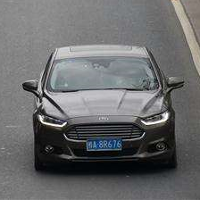

# Efficient Interactive Annotation of Segmentation Datasets
**Reimplementation of** *Efficient Interactive Annotation of Segmentation Datasets with Polygon-RNN++.*  
**This repository contains two main programs:**  
+ Reproduction of the entire paper  
I used the official model that has been trained,and some code is based on official pytorch reimplementation.
+ CNN image feature extractor  
This part is done by me.  

Reproduction of the entire paper  
-----
**dependencies:**  
+ python==3.5.4    
+ tensorflow==1.3.0  
+ scikit-image==0.14.2  
+ numpy==1.14.2  
+ matplotlib==2.2.2  
+ tqdm==4.19.9 

**usage:**
1. Dowload the trained model from www.cs.toronto.edu/polyrnn/models/$FILENAME .  
2. Unzip it and put the subfolder in the empty mates，at this step you may change their name to match paths in code.  
3. Run the rnn_main.py,that will take some time.  
4. View the output JSON files and tagged images in the output folder.

**output**  
Test case:  
   
Reduced subimages to match 224*224 rgb:   
   
Testing effect(use RNN or RNN+GGNN):   
  
Overall effect:  
   
Performance:  
  
  
Feature Extractor   
-----
**This part of the program mainly uses Keras.** 

**Main Idea:**    
  
+ Build a CNN model  without pooling or FC layers.   
>We also remove the original average pooling and FC layers  
+ Construct a ResNet-50 layer model based on reference[13] and reference[7]  
>we follow [7] and modify the ResNet-50 architecture [13] by reducing the stride of the network and introducing dilation factors.  
>  
DeepLab    
  
Batch Normalization  
  

**Additional Dependencies:**    
+ six==1.12.0    
+ Keras==2.2.2  

**Usage:**  
Just run extractor_main.py, the result will be presented to you in a Dialog.  

**Output**  
test case:  
    
effect:  
  
