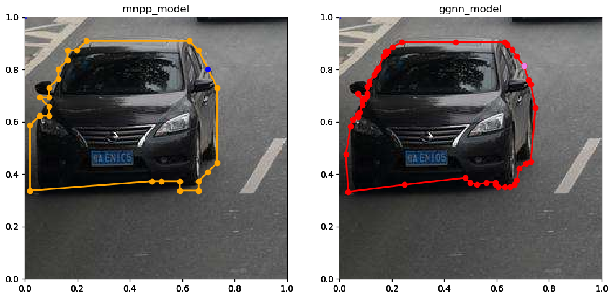

# interactive_annotation
**Reimplementation of** *Efficient Interactive Annotation of Segmentation Datasets with Polygon-RNN++.*  
**This repository contains two main programs:**  
+ Reproduction of the entire paper  
I used the official model that has been trained,and some code is based on official pytorch reimplementation.
+ CNN image feature extractor  
This part is done by me.  

Reproduction of the entire paper  
-----
**dependencies:**  
+ python==3.5.4    
+ tensorflow==1.3.0  
+ scikit-image==0.14.2  
+ numpy==1.14.2  
+ matplotlib==2.2.2  
+ tqdm==4.19.9 

**usage:**
1. Dowload the trained model from //www.cs.toronto.edu/polyrnn/models/$FILENAME .  
2. Unzip it and put the subfolder in the empty mates，at this step you may change their name to match paths in code.  
3. Run the rnn_main.py,that will take some time.  
4. View the output JSON files and tagged images in the output folder.

**output**  
test case:  
  
Reduced subimages to match 224*224 rgb:   
  
Testing effect(use RNN or RNN+GGNN):  
  
Overall effect:  

Performance:

Autograph   
-----

